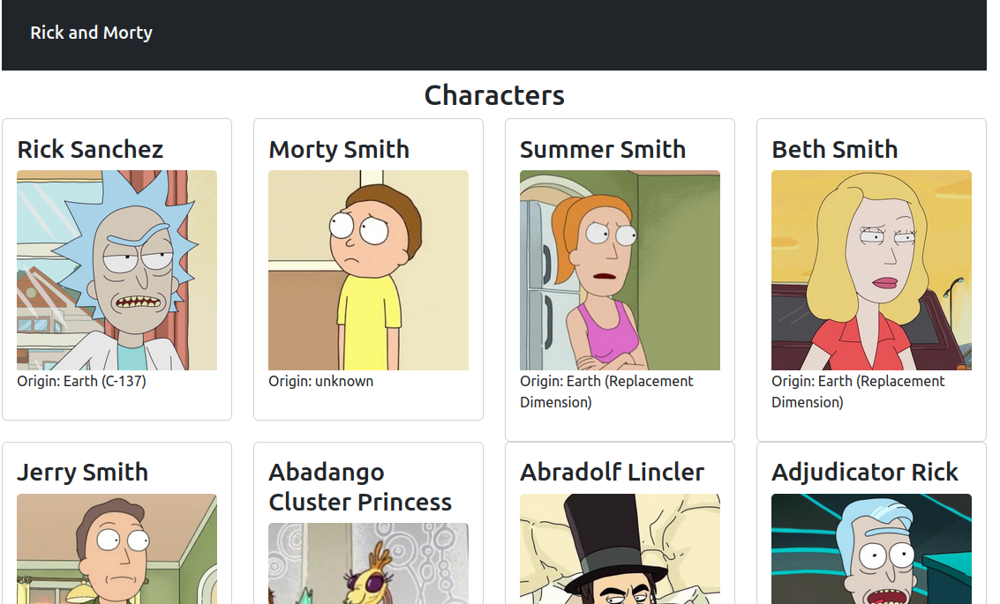

## Rick and Morty Characters
### This is a basic react page that retrieves and renders data about characters in the popular Rick and Morty Series :
In this sample project I learnt how to create a basic React application 
from scratch using React, ReactDOM , Webpack, Babel, ESLint and Bootstrap.

Webpack and Babel are libraries that helps to compile and run my Javascript and 
React code in the browser with minimal setup

Then I learnt how to structure my react application :
- Keeping my source code in an src folder 
- Generated compiled code in a dist folder 
- there is a public folder that contains my index.html file.

Components are normally written in seperate files and are kept in a seperate folder called "components" in the src folder.

URL for data fetching : https://rickandmortyapi.com/documentation/#rest
I learnt about state management and data fetching with useState and useEffect Hook from react. 

I also did some basic styling with pre written classes from React Bootstrap. 

